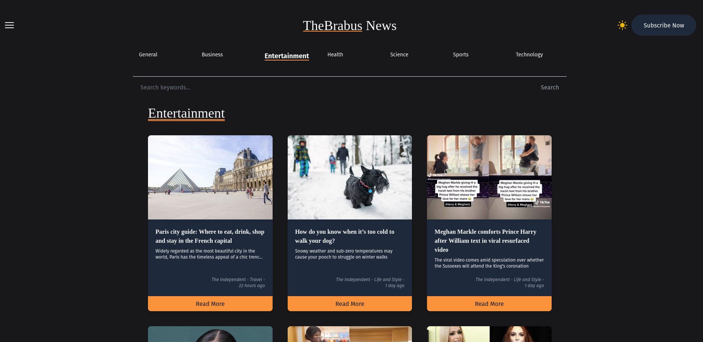

<br/>

<h4 align="center"> 
	🚧  Em construção...  🚧
</h4>

<br/>

# JP World News

## 🖥️ Sobre o projeto
=================

Este projeto simula tem como proposta reunir em um só ambiente uma porção atualizada de notícias que são fornecidas através de um serviço chamado mediastack.

Nesta aplicação web o usuário terá acesso a uma página listando diversas notícias sobre assuntos generalizados ao redor do mundo. Ao acessar a página o usuário poderá:

* Filtrar a listagem de notícias atráves de botões de categorias
* Acessar alguma notícias específica para ler os detalhes.
* Pesquisar por notícias utilizando palavras chave no campo de busca.
* Alterar entre modo escuro e modo claro através do clique de um botão.


## 📋 Tabela de conteúdos
=================
<!--ts-->
   * [Sobre o Projeto](##sobre-o-projeto)
   * [Tabela de Conteúdos](##tabela-de-conteudo)
   * [Tecnologias](##tecnologias)
   * [Pré-requisitos](##pre-requisitos)
   * [Como rodar a aplicação web](##como-rodar-a-aplicacao-web)
<!--te-->

## ⚒️ Tecnologias
=================

As seguintes ferrametnsa foram usadas na construção do projeto:
<ul>
  <li> <a href='https://nextjs.org/' target='_blank'> Next.js 13</a></li>
  <li> <a href='https://www.typescriptlang.org/' target='_blank'> Typescript </a></li>
  <li> <a href='https://tailwindcss.com/' target='_blank'> Tailwind </a></li>
  <li>
    <div>
      Bibliotecas:
      <ul>
        <li>
          <a href='https://heroicons.com/' target='_blank'>Heroicons</a>
        </li>
        <li>
          <a href='https://www.npmjs.com/package/graphql-request' target='_blank'>graphql-request</a>
        </li>
        <li>
          <a href='https://www.npmjs.com/package/next-themes' target='_blank'>next-themes</a>
        </li>
        <li>
          <a href='https://github.com/tailwindlabs/tailwindcss-line-clamp' target='_blank'>tailwindcss-line-clamp</a>
        </li>
        <li>
          <a href='https://www.npmjs.com/package/react-timeago' target='_blank'>react-timeago</a>
        </li>
      </ul>
    </div>
  </li>
</ul>

## ✅ Pré-requisitos
=================

Antes de começar, você vai precisar ter instalado em sua máquina as seguintes ferramentas:
* [Git](https://git-scm.com)
* [Node.js](https://nodejs.org/en/)
* [VSCode](https://code.visualstudio.com/) (Editor sugerido)

## ⚙️ Como rodar a aplicação web
=================

```bash
# Clone este repositório
$ git clone https://github.com/jp2mesquita/jp-news_jp2mesquita.git

#Acesse a pasta do projeto no terminal/cmd
$ cd jp-news_jp2mesquita

#Instale as dependências
$ npm install

#Inicie o projeto
$ npm run dev
```

## 🧔 Autor
=================

<a href="https://blog.rocketseat.com.br/author/thiago/">
 
 <br />
Desenvolvido com 💜 por João Paulo Mesquita

<br/>

[](https://www.linkedin.com/in/jo%C3%A3o-paulo-mesquita-02a4a3179/)  [](mailto:jp-mesquita@live.com)

